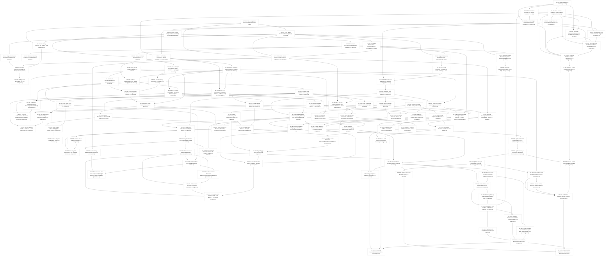

# Global Dependency Graph

> Generated: 2026-05-04

```mermaid
graph TD
    %% Nodes
    KP-001["KP-001: Repo Workspace Bootstrap (L1-data)"]:::pending
    KP-002["KP-002: Environment Contract and Secrets Boundary (L1-data)"]:::pending
    KP-003["KP-003: Tauri + React + TypeScript UI Foundation Init (L2-ui-foundation)"]:::pending
    KP-004["KP-004: Design Token and Theme Wiring Baseline (L2-ui-foundation)"]:::pending
    KP-005["KP-005: Rust Client Engine Skeleton and Module Boundaries (L3-backend)"]:::pending
    KP-006["KP-006: Go Relay Controller Skeleton and Health Endpoint Stub (L3-backend)"]:::pending
    KP-007["KP-007: Desktop App Shell Layout and Status Regions (L4-feature-ui)"]:::pending
    KP-008["KP-008: Monorepo Task Orchestration Scripts (dev/build/test) (L5-integration)"]:::pending
    KP-009["KP-009: CI Baseline Workflow Matrix (TS/Rust/Go) (L5-integration)"]:::pending
    KP-010["KP-010: SQLite Migration Framework Bootstrap (L1-data)"]:::pending
    KP-011["KP-011: Core Tables Creation Migration (v1_init) (L1-data)"]:::pending
    KP-012["KP-012: Constraint Enforcement (FK/CHECK/UTC timestamps) (L1-data)"]:::pending
    KP-013["KP-013: Baseline Indexing for Sessions and Telemetry (L1-data)"]:::pending
    KP-014["KP-014: Supported Games Seed Script (Idempotent) (L1-data)"]:::pending
    KP-015["KP-015: Rust DB Access Layer Skeleton (sqlite + migrations) (L3-backend)"]:::pending
    KP-016["KP-016: Go Relay Controller DB Binding Stub (L3-backend)"]:::pending
    KP-017["KP-017: Migration Execution in Local Dev Scripts (L5-integration)"]:::pending
    KP-018["KP-018: CI Migration Verification Job (L5-integration)"]:::pending
    KP-019["KP-019: UI Primitive Component Library Bootstrap (L2-ui-foundation)"]:::pending
    KP-020["KP-020: Token-Compliant Button/Input/Select/Badge Set (L2-ui-foundation)"]:::pending
    KP-021["KP-021: Surface Components (Card, Modal, Toast) (L2-ui-foundation)"]:::pending
    KP-022["KP-022: Shell Layout Components (AppShell, Sidebar, TopBar, Panel) (L2-ui-foundation)"]:::pending
    KP-023["KP-023: Accessibility Baseline for Interactive Primitives (L2-ui-foundation)"]:::pending
    KP-024["KP-024: Primary Toggle and Connection Status Badge (L4-feature-ui)"]:::pending
    KP-025["KP-025: Ping Metric Card and Relay Health List Item (L4-feature-ui)"]:::pending
    KP-026["KP-026: Game Detection Row and Onboarding Stepper (L4-feature-ui)"]:::pending
    KP-027["KP-027: UI Composition Showcase Page (foundation states) (L5-integration)"]:::pending
    KP-028["KP-028: UI Test Baseline (render + keyboard + visual guardrails) (L5-integration)"]:::pending
    KP-029["KP-029: Route Policy Config and Protocol Priority Constants (L3-backend)"]:::pending
    KP-030["KP-030: Manifest Verification Gate in Routing Activation (L3-backend)"]:::pending
    KP-031["KP-031: Relay Candidate Scoring Engine (L3-backend)"]:::pending
    KP-032["KP-032: Route Attempt Orchestrator (WG -> TCP/TLS -> QUIC) (L3-backend)"]:::pending
    KP-033["KP-033: Bounded Retry and Backoff Controller (L3-backend)"]:::pending
    KP-034["KP-034: Routing State Machine and Lifecycle Events (L3-backend)"]:::pending
    KP-035["KP-035: Rust Routing Engine Integration with Session Persistence Hooks (L3-backend)"]:::pending
    KP-036["KP-036: End-to-End Routing Simulation Harness (protocol fallback) (L5-integration)"]:::pending
    KP-037["KP-037: Contract Conformance Checks for Relay Input and Telemetry Output (L5-integration)"]:::pending
    KP-038["KP-038: Supported Games Allowlist Schema Refinement (L1-data)"]:::pending
    KP-039["KP-039: Seed and Versioning for Supported Game Catalog (L1-data)"]:::pending
    KP-040["KP-040: Windows Process Scanner Core (allowlist match) (L3-backend)"]:::pending
    KP-041["KP-041: Detection State Resolver and Freshness Window (L3-backend)"]:::pending
    KP-042["KP-042: Manual Rescan Command Handler (L3-backend)"]:::pending
    KP-043["KP-043: Detection Event Emission (game_detected) with Schema Guard (L3-backend)"]:::pending
    KP-044["KP-044: Detection-Routing Gate Integration Contract (L3-backend)"]:::pending
    KP-045["KP-045: Detection Status Panel and Rescan UX Wiring (L4-feature-ui)"]:::pending
    KP-046["KP-046: Detection Simulation and Anti-False-Positive Test Harness (L5-integration)"]:::pending
    KP-047["KP-047: Funnel Telemetry Validation for Detection-to-Activation Path (L5-integration)"]:::pending
    KP-048["KP-048: Relay Health Polling Scheduler (L3-backend)"]:::pending
    KP-049["KP-049: Health Classification Engine (ok/warn/dead) (L3-backend)"]:::pending
    KP-050["KP-050: Failover Trigger Evaluator and Hysteresis Window (L3-backend)"]:::pending
    KP-051["KP-051: Active Relay Switch Executor (L3-backend)"]:::pending
    KP-052["KP-052: Failover State/Reason Model for UI Bridge (L3-backend)"]:::pending
    KP-053["KP-053: Relay Failure and Recovery Telemetry Emission (L3-backend)"]:::pending
    KP-054["KP-054: Relay Health Surface Wiring (list + badge sync) (L4-feature-ui)"]:::pending
    KP-055["KP-055: Failover Progress Feedback UI States (L4-feature-ui)"]:::pending
    KP-056["KP-056: Failover Chaos Scenario Harness (L5-integration)"]:::pending
    KP-057["KP-057: Reliability KPI Aggregation Test for Relay Events (L5-integration)"]:::pending
    KP-058["KP-058: Toggle Command Lifecycle Orchestrator (L3-backend)"]:::pending
    KP-059["KP-059: ON Pipeline Gate Chain (Detection + Manifest + Route Precheck) (L3-backend)"]:::pending
    KP-060["KP-060: OFF Pipeline Safe Teardown and Session Finalization (L3-backend)"]:::pending
    KP-061["KP-061: Toggle Idempotency and Concurrency Guard (L3-backend)"]:::pending
    KP-062["KP-062: Lifecycle Timeout and Error Transition Policy (L3-backend)"]:::pending
    KP-063["KP-063: ON/OFF Telemetry Event Mapping with Reason Codes (L3-backend)"]:::pending
    KP-064["KP-064: Primary Toggle Wiring to Lifecycle Commands (L4-feature-ui)"]:::pending
    KP-065["KP-065: Lifecycle Status Presenter (idle/arming/active/disarming/error) (L4-feature-ui)"]:::pending
    KP-066["KP-066: Rapid Toggle Stress Harness (L5-integration)"]:::pending
    KP-067["KP-067: Activation Funnel Event Sequence Validator (L5-integration)"]:::pending
    KP-068["KP-068: Probe Loop Scheduler and Lifecycle Binding (L3-backend)"]:::pending
    KP-069["KP-069: Ping/Jitter/Packet-Loss Computation Module (L3-backend)"]:::pending
    KP-070["KP-070: Metric Freshness and Degraded-State Evaluator (L3-backend)"]:::pending
    KP-071["KP-071: Metrics Ring-Buffer Persistence Adapter (L3-backend)"]:::pending
    KP-072["KP-072: ping_measured Telemetry Emitter with Schema Guard (L3-backend)"]:::pending
    KP-073["KP-073: Real-Time Metric Card Data Binding (L4-feature-ui)"]:::pending
    KP-074["KP-074: Dashboard State Presenter (idle/measuring/live/degraded/error) (L4-feature-ui)"]:::pending
    KP-075["KP-075: Metric Trend Mini-View (optional lightweight sparkline-ready container) (L4-feature-ui)"]:::pending
    KP-076["KP-076: Probe Failure Recovery Integration Harness (L5-integration)"]:::pending
    KP-077["KP-077: Performance KPI Validation Suite from Metrics + Events (L5-integration)"]:::pending
    KP-078["KP-078: Telemetry Queue Metadata Migration (retry/expiry diagnostics) (L1-data)"]:::pending
    KP-079["KP-079: Telemetry Retention and Purge Policy SQL Jobs (L1-data)"]:::pending
    KP-080["KP-080: Event Schema Allowlist Validator Core (L3-backend)"]:::pending
    KP-081["KP-081: Sensitive Field Scrubber and Policy Engine (L3-backend)"]:::pending
    KP-082["KP-082: Batch Builder and Queue Backpressure Controller (L3-backend)"]:::pending
    KP-083["KP-083: Telemetry Delivery Client with Idempotency Key (L3-backend)"]:::pending
    KP-084["KP-084: Retry/Expiry State Machine for Telemetry Batches (L3-backend)"]:::pending
    KP-085["KP-085: Pipeline Health Snapshot Aggregator (L3-backend)"]:::pending
    KP-086["KP-086: Telemetry Contract Conformance Integration Suite (L5-integration)"]:::pending
    KP-087["KP-087: Privacy Violation Injection Harness (red-team style payload tests) (L5-integration)"]:::pending
    KP-088["KP-088: Delivery Reliability KPI Validation Suite (L5-integration)"]:::pending
    KP-089["KP-089: Onboarding State Machine Core (L3-backend)"]:::pending
    KP-090["KP-090: Permission & Environment Check Handlers (L3-backend)"]:::pending
    KP-091["KP-091: Resume Checkpoint Persistence (onboarding_state) (L3-backend)"]:::pending
    KP-092["KP-092: Completion Gate on First Successful Connect (L3-backend)"]:::pending
    KP-093["KP-093: onboarding_completed Telemetry Emission (L3-backend)"]:::pending
    KP-094["KP-094: Onboarding Stepper Flow Screens (L4-feature-ui)"]:::pending
    KP-095["KP-095: Recovery Branch UX (retry, troubleshoot, continue-safe) (L4-feature-ui)"]:::pending
    KP-096["KP-096: Onboarding Progress Resume UX (L4-feature-ui)"]:::pending
    KP-097["KP-097: End-to-End Onboarding Journey Harness (L5-integration)"]:::pending
    KP-098["KP-098: Onboarding Funnel KPI Validation Suite (L5-integration)"]:::pending
    KP-099["KP-099: Updater Channel Resolver and Check Scheduler (L3-backend)"]:::pending
    KP-100["KP-100: Update Package Verification and Apply Orchestrator (L3-backend)"]:::pending
    KP-101["KP-101: Updater Lifecycle State Model and Error Taxonomy (L3-backend)"]:::pending
    KP-102["KP-102: Updater Telemetry Event Mapping (L3-backend)"]:::pending
    KP-103["KP-103: Updater Status UI Panel and Action Controls (L4-feature-ui)"]:::pending
    KP-104["KP-104: Restart Prompt and Post-Update UX Flow (L4-feature-ui)"]:::pending
    KP-105["KP-105: CI Stable Signing Gate Enforcement (L5-integration)"]:::pending
    KP-106["KP-106: Release Artifact Trust Validation Harness (L5-integration)"]:::pending
    KP-107["KP-107: End-to-End Updater Journey Harness (L5-integration)"]:::pending
    KP-108["KP-108: Update Adoption and Failure KPI Validation Suite (L5-integration)"]:::pending

    %% Dependencies
    KP-001 --> KP-002
    KP-001 --> KP-003
    KP-003 --> KP-004
    KP-001 --> KP-005
    KP-002 --> KP-005
    KP-001 --> KP-006
    KP-002 --> KP-006
    KP-003 --> KP-007
    KP-004 --> KP-007
    KP-003 --> KP-008
    KP-005 --> KP-008
    KP-006 --> KP-008
    KP-007 --> KP-008
    KP-003 --> KP-009
    KP-005 --> KP-009
    KP-006 --> KP-009
    KP-008 --> KP-009
    KP-010 --> KP-011
    KP-011 --> KP-012
    KP-012 --> KP-013
    KP-011 --> KP-014
    KP-010 --> KP-015
    KP-011 --> KP-015
    KP-012 --> KP-015
    KP-010 --> KP-016
    KP-011 --> KP-016
    KP-014 --> KP-017
    KP-015 --> KP-017
    KP-016 --> KP-017
    KP-017 --> KP-018
    KP-003 --> KP-019
    KP-004 --> KP-019
    KP-019 --> KP-020
    KP-019 --> KP-021
    KP-020 --> KP-021
    KP-019 --> KP-022
    KP-020 --> KP-022
    KP-020 --> KP-023
    KP-021 --> KP-023
    KP-020 --> KP-024
    KP-023 --> KP-024
    KP-021 --> KP-025
    KP-022 --> KP-025
    KP-022 --> KP-026
    KP-023 --> KP-026
    KP-024 --> KP-027
    KP-025 --> KP-027
    KP-026 --> KP-027
    KP-023 --> KP-028
    KP-027 --> KP-028
    KP-005 --> KP-029
    KP-029 --> KP-030
    KP-029 --> KP-031
    KP-030 --> KP-031
    KP-031 --> KP-032
    KP-032 --> KP-033
    KP-033 --> KP-034
    KP-015 --> KP-035
    KP-034 --> KP-035
    KP-032 --> KP-036
    KP-033 --> KP-036
    KP-034 --> KP-036
    KP-034 --> KP-037
    KP-036 --> KP-037
    KP-011 --> KP-038
    KP-012 --> KP-038
    KP-038 --> KP-039
    KP-005 --> KP-040
    KP-039 --> KP-040
    KP-040 --> KP-041
    KP-041 --> KP-042
    KP-041 --> KP-043
    KP-034 --> KP-043
    KP-041 --> KP-044
    KP-032 --> KP-044
    KP-042 --> KP-045
    KP-024 --> KP-045
    KP-026 --> KP-045
    KP-044 --> KP-046
    KP-043 --> KP-047
    KP-045 --> KP-047
    KP-046 --> KP-047
    KP-031 --> KP-048
    KP-048 --> KP-049
    KP-049 --> KP-050
    KP-033 --> KP-050
    KP-050 --> KP-051
    KP-032 --> KP-051
    KP-051 --> KP-052
    KP-034 --> KP-052
    KP-051 --> KP-053
    KP-052 --> KP-053
    KP-043 --> KP-053
    KP-052 --> KP-054
    KP-025 --> KP-054
    KP-054 --> KP-055
    KP-053 --> KP-056
    KP-053 --> KP-057
    KP-056 --> KP-057
    KP-034 --> KP-058
    KP-044 --> KP-059
    KP-030 --> KP-059
    KP-058 --> KP-059
    KP-058 --> KP-060
    KP-035 --> KP-060
    KP-058 --> KP-061
    KP-059 --> KP-062
    KP-060 --> KP-062
    KP-059 --> KP-063
    KP-060 --> KP-063
    KP-043 --> KP-063
    KP-061 --> KP-064
    KP-024 --> KP-064
    KP-062 --> KP-065
    KP-064 --> KP-065
    KP-061 --> KP-066
    KP-065 --> KP-066
    KP-063 --> KP-067
    KP-066 --> KP-067
    KP-047 --> KP-067
    KP-060 --> KP-068
    KP-034 --> KP-068
    KP-068 --> KP-069
    KP-069 --> KP-070
    KP-069 --> KP-071
    KP-015 --> KP-071
    KP-069 --> KP-072
    KP-043 --> KP-072
    KP-070 --> KP-073
    KP-025 --> KP-073
    KP-070 --> KP-074
    KP-073 --> KP-074
    KP-071 --> KP-075
    KP-073 --> KP-075
    KP-070 --> KP-076
    KP-074 --> KP-076
    KP-072 --> KP-077
    KP-076 --> KP-077
    KP-067 --> KP-077
    KP-011 --> KP-078
    KP-012 --> KP-078
    KP-078 --> KP-079
    KP-072 --> KP-080
    KP-063 --> KP-080
    KP-053 --> KP-080
    KP-080 --> KP-081
    KP-080 --> KP-082
    KP-081 --> KP-082
    KP-082 --> KP-083
    KP-082 --> KP-084
    KP-083 --> KP-084
    KP-079 --> KP-084
    KP-084 --> KP-085
    KP-083 --> KP-086
    KP-084 --> KP-086
    KP-081 --> KP-087
    KP-086 --> KP-087
    KP-085 --> KP-088
    KP-086 --> KP-088
    KP-087 --> KP-088
    KP-034 --> KP-089
    KP-089 --> KP-090
    KP-048 --> KP-090
    KP-089 --> KP-091
    KP-015 --> KP-091
    KP-059 --> KP-092
    KP-091 --> KP-092
    KP-092 --> KP-093
    KP-080 --> KP-093
    KP-089 --> KP-094
    KP-026 --> KP-094
    KP-090 --> KP-095
    KP-094 --> KP-095
    KP-091 --> KP-096
    KP-094 --> KP-096
    KP-092 --> KP-097
    KP-096 --> KP-097
    KP-093 --> KP-098
    KP-097 --> KP-098
    KP-088 --> KP-098
    KP-002 --> KP-099
    KP-062 --> KP-099
    KP-099 --> KP-100
    KP-100 --> KP-101
    KP-101 --> KP-102
    KP-080 --> KP-102
    KP-101 --> KP-103
    KP-020 --> KP-103
    KP-103 --> KP-104
    KP-009 --> KP-105
    KP-100 --> KP-106
    KP-105 --> KP-106
    KP-103 --> KP-107
    KP-104 --> KP-107
    KP-106 --> KP-107
    KP-102 --> KP-108
    KP-107 --> KP-108
    KP-088 --> KP-108

    %% Styles
    classDef done fill:#d4f0f0,stroke:#007777,stroke-width:2px;
    classDef pending fill:#ffffff,stroke:#cccccc,stroke-width:1px;
    classDef external fill:#eeeeee,stroke:#999999,stroke-dasharray: 5 5;
```

## Ready To Start
- KP-001: Repo Workspace Bootstrap
- KP-010: SQLite Migration Framework Bootstrap
