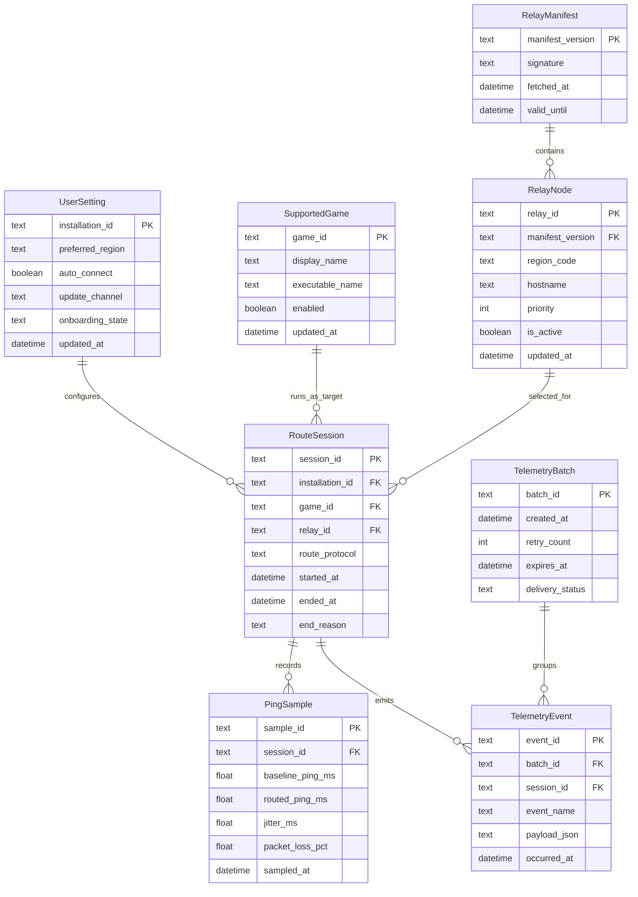

# Entity Relationship Diagram

**Project:** Kurangi Ping
**Scope:** Core
**Date:** 2026-05-03

---

## 1. Entity Catalog

| Entity Name | Description | Type | Primary Key |
|---|---|---|---|
| UserSetting | Singleton konfigurasi instalasi lokal user | Strong | installation_id |
| SupportedGame | Daftar game allowlist yang didukung deteksi | Strong | game_id |
| RelayManifest | Snapshot manifest relay yang sudah diverifikasi signature | Strong | manifest_version |
| RelayNode | Node relay yang tersedia untuk routing | Strong | relay_id |
| RouteSession | Satu sesi routing ON-OFF untuk game tertentu | Strong | session_id |
| PingSample | Sampel metrik ping/jitter/loss dalam suatu sesi | Strong | sample_id |
| TelemetryBatch | Unit pengiriman batch event telemetry | Strong | batch_id |
| TelemetryEvent | Event telemetry anonim yang dikirim/diantrikan | Strong | event_id |

---

## 2. Entity Details

### UserSetting
**Description:** Menyimpan preferensi user per instalasi aplikasi.

**Attributes:**
| Attribute | Data Type | Constraints | Description |
|---|---|---|---|
| installation_id | TEXT | PK, NOT NULL | ID instalasi lokal |
| preferred_region | TEXT | NULL, CHECK enum(region) | Region preferensi relay |
| auto_connect | INTEGER | NOT NULL, CHECK (0/1) | Toggle auto-connect |
| update_channel | TEXT | NOT NULL, CHECK enum(beta,stable) | Channel updater |
| onboarding_state | TEXT | NOT NULL, CHECK enum(not_started,in_progress,completed) | State onboarding |
| updated_at | DATETIME | NOT NULL | Waktu perubahan terakhir |

**Business Rules:**
- Satu instalasi hanya boleh memiliki satu row konfigurasi aktif.
- Nilai enum wajib tervalidasi sebelum persist.

### SupportedGame
**Description:** Referensi game yang dapat dideteksi secara aman via process listing.

**Attributes:**
| Attribute | Data Type | Constraints | Description |
|---|---|---|---|
| game_id | TEXT | PK, NOT NULL | ID game (mis. ffxiv) |
| display_name | TEXT | NOT NULL | Nama game untuk UI |
| executable_name | TEXT | NOT NULL, UNIQUE, lowercase `.exe`, no path separator | Nama executable allowlist |
| match_mode | TEXT | NOT NULL, default `exact` | Mode matching executable |
| catalog_version | TEXT | NOT NULL, format `v<number>` | Versi katalog allowlist saat row dibuat/diupdate |
| enabled | INTEGER | NOT NULL, CHECK (0/1) | Status support aktif |
| updated_at | DATETIME | NOT NULL | Waktu update definisi game |

**Business Rules:**
- Hanya executable pada allowlist yang boleh dianggap valid detection.
- `game_id` wajib lowercase snake-ish (`[a-z0-9_]`) untuk konsistensi pencocokan internal.
- `executable_name` harus nama file executable saja (bukan full path) untuk mencegah false positive berbasis path.

### RelayManifest
**Description:** Metadata manifest relay yang diterima client.

**Attributes:**
| Attribute | Data Type | Constraints | Description |
|---|---|---|---|
| manifest_version | TEXT | PK, NOT NULL | Versi manifest |
| signature | TEXT | NOT NULL | Signature base64 |
| fetched_at | DATETIME | NOT NULL | Waktu fetch |
| valid_until | DATETIME | NOT NULL | Batas validitas manifest |

**Business Rules:**
- Manifest tidak boleh dipakai jika signature tidak valid.
- Manifest expired wajib di-refresh sebelum route baru dibentuk.

### RelayNode
**Description:** Daftar node relay dari manifest untuk route selection.

**Attributes:**
| Attribute | Data Type | Constraints | Description |
|---|---|---|---|
| relay_id | TEXT | PK, NOT NULL | ID relay unik |
| manifest_version | TEXT | FK -> RelayManifest.manifest_version, NOT NULL | Sumber manifest |
| region_code | TEXT | NOT NULL | Kode region (sin, nrt, us) |
| hostname | TEXT | NOT NULL | Host relay |
| priority | INTEGER | NOT NULL | Prioritas seleksi |
| is_active | INTEGER | NOT NULL, CHECK (0/1) | Status node aktif |
| updated_at | DATETIME | NOT NULL | Waktu update node |

**Business Rules:**
- RelayNode harus selalu terkait ke RelayManifest valid.

### RouteSession
**Description:** Rekam sesi ketika user mengaktifkan routing sampai dimatikan.

**Attributes:**
| Attribute | Data Type | Constraints | Description |
|---|---|---|---|
| session_id | TEXT | PK, NOT NULL | ID sesi unik |
| installation_id | TEXT | FK -> UserSetting.installation_id, NOT NULL | Referensi instalasi |
| game_id | TEXT | FK -> SupportedGame.game_id, NOT NULL | Game target |
| relay_id | TEXT | FK -> RelayNode.relay_id, NULL | Relay terpilih |
| route_protocol | TEXT | NOT NULL, CHECK enum(wireguard,tcp_tls,quic) | Protocol aktif |
| started_at | DATETIME | NOT NULL | Mulai sesi |
| ended_at | DATETIME | NULL | Akhir sesi |
| end_reason | TEXT | NULL | Alasan sesi berakhir |

**Business Rules:**
- Route protocol mengikuti urutan prioritas WireGuard -> TCP/TLS -> QUIC.
- Session aktif hanya satu per instalasi pada satu waktu.

### PingSample
**Description:** Sampel performa jaringan per sesi.

**Attributes:**
| Attribute | Data Type | Constraints | Description |
|---|---|---|---|
| sample_id | TEXT | PK, NOT NULL | ID sampel |
| session_id | TEXT | FK -> RouteSession.session_id, NOT NULL | Relasi ke sesi |
| baseline_ping_ms | REAL | NOT NULL, CHECK >= 0 | Ping baseline |
| routed_ping_ms | REAL | NULL, CHECK >= 0 | Ping saat route aktif |
| jitter_ms | REAL | NULL, CHECK >= 0 | Jitter |
| packet_loss_pct | REAL | NULL, CHECK 0..100 | Packet loss |
| sampled_at | DATETIME | NOT NULL | Timestamp sampel |

**Business Rules:**
- PingSample harus terkait ke RouteSession yang valid.

### TelemetryBatch
**Description:** Unit batch untuk retry dan delivery control telemetry.

**Attributes:**
| Attribute | Data Type | Constraints | Description |
|---|---|---|---|
| batch_id | TEXT | PK, NOT NULL | ID batch |
| created_at | DATETIME | NOT NULL | Waktu batch dibuat |
| retry_count | INTEGER | NOT NULL, CHECK >= 0 | Jumlah retry |
| expires_at | DATETIME | NOT NULL | Batas batch dianggap stale |
| delivery_status | TEXT | NOT NULL, CHECK enum(queued,sent,failed,expired) | Status batch |

**Business Rules:**
- Retry dibatasi sesuai kebijakan fail-safe.

### TelemetryEvent
**Description:** Event anonymized sesuai schema allowlist.

**Attributes:**
| Attribute | Data Type | Constraints | Description |
|---|---|---|---|
| event_id | TEXT | PK, NOT NULL | ID event |
| batch_id | TEXT | FK -> TelemetryBatch.batch_id, NOT NULL | Batch pengiriman |
| session_id | TEXT | FK -> RouteSession.session_id, NULL | Korelasi sesi |
| event_name | TEXT | NOT NULL | Nama event |
| payload_json | TEXT | NOT NULL | Payload event |
| occurred_at | DATETIME | NOT NULL | Waktu event |

**Business Rules:**
- Payload hanya boleh field allowlist; PII tidak boleh tersimpan.

---

## 3. Relationship Specifications

| Relationship | Entity A | Entity B | Cardinality | Participation | Description |
|---|---|---|---|---|---|
| configures | UserSetting | RouteSession | 1:N | Total on RouteSession | Satu instalasi dapat punya banyak sesi routing |
| runs_as_target | SupportedGame | RouteSession | 1:N | Total on RouteSession | Satu game dapat muncul di banyak sesi |
| contains | RelayManifest | RelayNode | 1:N | Total on RelayNode | Satu manifest berisi banyak relay |
| selected_for | RelayNode | RouteSession | 1:N | Partial on RouteSession | Satu relay bisa dipakai banyak sesi |
| records | RouteSession | PingSample | 1:N | Total on PingSample | Satu sesi punya banyak sampel metrik |
| emits | RouteSession | TelemetryEvent | 1:N | Partial on TelemetryEvent | Satu sesi menghasilkan event telemetry |
| groups | TelemetryBatch | TelemetryEvent | 1:N | Total on TelemetryEvent | Satu batch mengandung banyak event |

---

## 4. ERD Diagram (Mermaid)

---

## 5. Design Decisions & Notes

- Model dipisah antara `RouteSession` dan `PingSample` agar 3NF lebih bersih dan query performa lebih mudah.
- Telemetry dipisah `TelemetryBatch` + `TelemetryEvent` untuk memenuhi kebutuhan retry policy sekaligus audit event tanpa menyimpan data sensitif.
- `UserSetting` dimodelkan singleton logical entity (per installation), sesuai arsitektur app tanpa akun user.
- Semua entity memiliki relasi (no orphan entities).
- Audit timestamps (`created_at`/`updated_at`) diterapkan pada entity relevan; event/time-series memakai timestamp domain (`started_at`, `sampled_at`, `occurred_at`).
