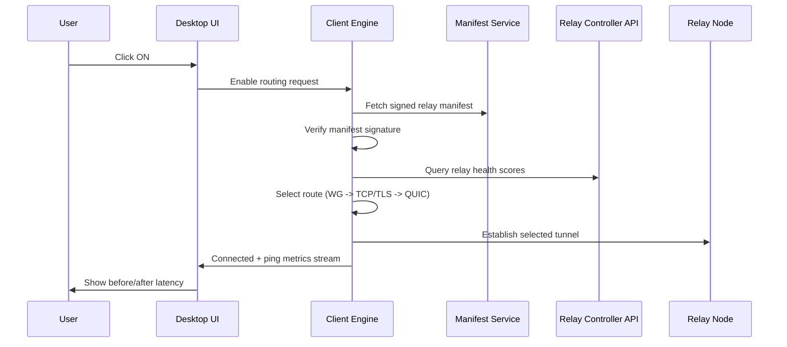

# Functional Specification Document (FSD) - Kurangi Ping
> Version 1.0 · Status: Draft Approved · Date: 2026-05-03

---

## Document Information

| Field | Value |
|---|---|
| Document Title | Functional Specification Document - Kurangi Ping |
| Version | 1.0 |
| Date | 2026-05-03 |
| PRD Reference | docs/prd.md |
| Tech Stack Reference | docs/tech-stack.md |
| Author | Product Owner / Solo Developer |
| Reviewers/Approvers | Product Owner |

---

## 1. Executive Summary

Kurangi Ping SHALL provide a Windows desktop routing optimizer that reduces cross-region gaming latency using a safe network-level architecture. The system SHALL prioritize privacy, one-click usability, and resilient routing behavior under unstable relay conditions.

---

## 2. Scope

### 2.1 In Scope

- Windows 10/11 desktop app.
- Auto-detection of supported game processes.
- One-click route enable/disable.
- Real-time before/after latency dashboard.
- Relay failover using prioritized routing strategy.
- Anonymous, schema-controlled telemetry.

### 2.2 Out of Scope

- macOS/Linux clients.
- Mobile apps.
- Manual advanced route editing by end users.
- User account or identity system in v1.

### 2.3 Assumptions

- Target users accept internet-dependent operation.
- Relay capacity starts on free/low-cost tiers and may fluctuate.
- Supported game list is allowlist-based and curated.

### 2.4 Dependencies

- Relay regions and uptime on Fly.io.
- Signed manifest hosting and key management.
- GitHub Releases availability for update channel.

---

## 3. System Architecture (Functional View)

### 3.1 Functional Components

- Desktop UI (Tauri + React) for user interaction and onboarding.
- Client Engine (Rust) for game detection, route control, telemetry batching.
- Local Data Store (SQLite) for settings and ring-buffer metrics.
- Relay Control API (Go) for health/availability metadata.
- Multi-region Relay Nodes for traffic optimization path.

### 3.2 Functional Flow



---

## 4. User Roles & Permissions

| Role | Description | Key Capabilities |
|---|---|---|
| End User | Gamer using desktop app | Start/stop routing, view status/ping, view errors |
| Product Owner/Admin | Maintainer of relays and release pipeline | Publish manifests, rotate keys, release updates |
| Contributor | OSS collaborator | Submit code/docs changes via repository workflow |

---

## 5. Global Functional Requirements

### FR-001: Application Startup and Readiness
- **Description:** System SHALL initialize config, local DB, and service health checks at startup.
- **Priority:** Must Have
- **PRD Reference:** Sections 7, 8 (US-01, US-05)
- **Business Rules:**
  - BR-001: Startup SHALL complete within acceptable UX threshold on standard hardware.
  - BR-002: Missing/invalid local config SHALL auto-fallback to safe defaults.
- **Acceptance Criteria:**
  - [ ] Given app is launched, when initialization succeeds, then main dashboard loads with status "Ready".
  - [ ] Given config is malformed, when app starts, then safe defaults load and warning is shown.
- **Error Handling:**
  - DB open failure -> app enters limited mode and surfaces remediation prompt.

### FR-002: Supported Game Detection
- **Description:** System SHALL detect supported game processes using allowlisted executables.
- **Priority:** Must Have
- **PRD Reference:** Section 8 (US-02)
- **Business Rules:**
  - BR-003: Detection SHALL use process listing only (no process injection).
  - BR-004: Only allowlisted process signatures/names SHALL be considered valid.
- **Acceptance Criteria:**
  - [ ] Given supported game is running, when scan runs, then game is flagged detected.
  - [ ] Given unsupported process, when scan runs, then no false-positive detection occurs.
- **Error Handling:**
  - Insufficient process permissions -> show troubleshooting guidance.

### FR-003: Routing Enable Flow
- **Description:** System SHALL establish best-available route on user ON action.
- **Priority:** Must Have
- **PRD Reference:** Section 7, Section 8 (US-01, US-03)
- **Business Rules:**
  - BR-005: Route selection order SHALL be WireGuard, then TCP/TLS, then QUIC.
  - BR-006: System SHALL verify signed manifest before using relay entries.
- **Acceptance Criteria:**
  - [ ] Given ON is clicked, when healthy relay exists, then connection is established and status is Connected.
  - [ ] Given WireGuard path fails, when fallback is available, then TCP/TLS path is attempted automatically.
- **Error Handling:**
  - Signature verification fails -> block routing and mark manifest invalid.

### FR-004: Routing Disable and Safe Revert
- **Description:** System SHALL safely disable active route and restore baseline network path.
- **Priority:** Must Have
- **PRD Reference:** Section 8 (US-04)
- **Business Rules:**
  - BR-007: Disable action SHALL be idempotent.
  - BR-008: Partial tunnel state SHALL be cleaned during disable.
- **Acceptance Criteria:**
  - [ ] Given route active, when OFF is clicked, then route is torn down and status is Disconnected.
  - [ ] Given duplicate OFF action, when repeated, then no error state is introduced.
- **Error Handling:**
  - Tunnel teardown timeout -> force cleanup and log non-sensitive diagnostic code.

### FR-005: Real-Time Performance Dashboard
- **Description:** System SHALL display baseline and optimized metrics continuously while active.
- **Priority:** Must Have
- **PRD Reference:** Section 8 (US-03)
- **Business Rules:**
  - BR-009: Dashboard SHALL expose ping, jitter, and packet loss.
  - BR-010: Metrics SHALL persist in local ring-buffer for session analysis.
- **Acceptance Criteria:**
  - [ ] Given active session, when probes complete, then dashboard updates values in near-real-time.
  - [ ] Given no route active, when probes run, then baseline remains visible.
- **Error Handling:**
  - Probe failure -> keep last known value and mark probe status degraded.

### FR-006: Relay Failure Detection and Failover
- **Description:** System SHALL detect relay connection failure and execute failover attempt.
- **Priority:** Must Have
- **PRD Reference:** Section 7 alt flow, Section 8 (US-06)
- **Business Rules:**
  - BR-011: relay_failed event SHALL be emitted on each failed connection attempt.
  - BR-012: Retry count and backoff SHALL be bounded.
- **Acceptance Criteria:**
  - [ ] Given current relay fails, when failure detected, then fallback route attempt starts automatically.
  - [ ] Given all candidates fail, when retries exhausted, then user is shown actionable failure state.
- **Error Handling:**
  - No healthy relay -> disable route request and surface status "No relay available".

### FR-007: Privacy and Telemetry Boundaries
- **Description:** System SHALL enforce anonymous telemetry with strict schema allowlist.
- **Priority:** Must Have
- **PRD Reference:** Sections 4, 9 (US-07, US-10)
- **Business Rules:**
  - BR-013: Telemetry SHALL exclude packet payload and direct identifiers.
  - BR-014: Telemetry endpoint SHALL not persist raw source IP.
- **Acceptance Criteria:**
  - [ ] Given event emitted, when payload validated, then non-allowlisted fields are dropped/rejected.
  - [ ] Given telemetry transport, when event sent, then payload contains no user PII fields.
- **Error Handling:**
  - Endpoint unavailable -> batch locally with expiration and retry policy.

### FR-008: Onboarding Completion Funnel
- **Description:** System SHALL guide first-time users to first successful connection.
- **Priority:** Should Have
- **PRD Reference:** Section 8 (US-05)
- **Business Rules:**
  - BR-015: onboarding_completed SHALL fire only after first successful connected state.
  - BR-016: Onboarding copy SHALL remain non-technical and concise.
- **Acceptance Criteria:**
  - [ ] Given first launch, when user follows onboarding, then first connect can complete in target duration.
  - [ ] Given onboarding exit, when user resumes later, then progress state is retained.
- **Error Handling:**
  - Onboarding interrupted -> resume from last completed step.

### FR-009: Update Delivery
- **Description:** System SHALL support in-app update checks and install flow.
- **Priority:** Should Have
- **PRD Reference:** Section 10 (Open Questions to close)
- **Business Rules:**
  - BR-017: Public release channel SHALL distribute signed artifacts only.
  - BR-018: Update metadata SHALL be fetched over TLS.
- **Acceptance Criteria:**
  - [ ] Given new release on selected channel, when check runs, then update prompt is shown.
  - [ ] Given user accepts update, when download completes, then app transitions to updated version workflow.
- **Error Handling:**
  - Update manifest error -> keep running current version and notify user.

### FR-010: Windows Distribution Trust
- **Description:** Public launch builds SHALL be code-signed before distribution.
- **Priority:** Must Have
- **PRD Reference:** Notes + launch readiness constraints
- **Business Rules:**
  - BR-019: Unsigned production artifact SHALL fail release gate.
- **Acceptance Criteria:**
  - [ ] Given release pipeline executes for stable channel, when signing step fails, then release is blocked.
  - [ ] Given signed artifact, when downloaded on Windows, then SmartScreen trust warning is reduced per cert trust level.
- **Error Handling:**
  - Signing service unavailable -> release remains pending, not published.

---

## 6. Global Business Rules Catalog

| ID | Rule | Applies To | Validation |
|---|---|---|---|
| BR-001 | Startup SHALL complete to ready state with safe defaults fallback. | FR-001 | Startup integration tests |
| BR-002 | Invalid config SHALL not prevent safe app launch. | FR-001 | Config corruption tests |
| BR-003 | Detection uses process listing only, no injection. | FR-002 | Security review checklist |
| BR-004 | Only allowlisted executables are valid detections. | FR-002 | Detection unit tests |
| BR-005 | Route order: WireGuard -> TCP/TLS -> QUIC. | FR-003 | Route selection tests |
| BR-006 | Signed manifest verification is mandatory before routing. | FR-003 | Signature validation tests |
| BR-007 | OFF action is idempotent. | FR-004 | Repeated disable tests |
| BR-008 | Tunnel resources are cleaned after disable. | FR-004 | Resource leak tests |
| BR-009 | Dashboard exposes ping, jitter, packet loss. | FR-005 | UI contract tests |
| BR-010 | Metrics persisted in local ring-buffer. | FR-005 | SQLite write/read tests |
| BR-011 | relay_failed emitted on failed relay connect. | FR-006 | Telemetry event tests |
| BR-012 | Failover retries are bounded with backoff. | FR-006 | Retry policy tests |
| BR-013 | Telemetry excludes payload and direct identifiers. | FR-007 | Schema validation tests |
| BR-014 | Source IP is not retained by telemetry service. | FR-007 | Infra config audit |
| BR-015 | onboarding_completed fires only on first successful connect. | FR-008 | Funnel logic tests |
| BR-016 | Onboarding text remains non-technical. | FR-008 | UX review |
| BR-017 | Stable channel artifacts must be signed. | FR-009/FR-010 | CI release gate |
| BR-018 | Update metadata fetched via TLS only. | FR-009 | Transport security tests |
| BR-019 | Unsigned artifact blocks public release. | FR-010 | CI policy enforcement |

---

## 7. Data Dictionary

### 7.1 Core Entities

#### Entity: user_settings

| Field | Type | Required | Validation Rules | Description |
|---|---|---|---|---|
| id | TEXT | Yes | Constant single-row key | Settings row identifier |
| preferred_region | TEXT | No | Enum: sin,nrt,us,auto | User relay preference |
| auto_connect | INTEGER | Yes | 0 or 1 | Auto-connect toggle |
| onboarding_state | TEXT | Yes | Enum: not_started,in_progress,completed | Funnel progress |
| update_channel | TEXT | Yes | Enum: beta,stable | Release channel |
| updated_at | TEXT | Yes | ISO-8601 UTC | Last settings update timestamp |

#### Entity: relay_manifest_cache

| Field | Type | Required | Validation Rules | Description |
|---|---|---|---|---|
| version | TEXT | Yes | Semantic version string | Manifest version |
| signature | TEXT | Yes | Base64 signature | Manifest signature blob |
| payload_json | TEXT | Yes | Valid JSON | Relay entries payload |
| fetched_at | TEXT | Yes | ISO-8601 UTC | Fetch timestamp |
| valid_until | TEXT | Yes | ISO-8601 UTC future time | Manifest TTL |

#### Entity: session_metrics

| Field | Type | Required | Validation Rules | Description |
|---|---|---|---|---|
| id | INTEGER | Yes | Auto increment | Metric row key |
| session_id | TEXT | Yes | UUID format | Session correlation id |
| timestamp | TEXT | Yes | ISO-8601 UTC | Measurement time |
| baseline_ping_ms | REAL | Yes | >=0 | Ping without route |
| routed_ping_ms | REAL | No | >=0 | Ping with route |
| jitter_ms | REAL | No | >=0 | Jitter metric |
| packet_loss_pct | REAL | No | 0-100 | Packet loss percentage |
| relay_id | TEXT | No | Allowlist value | Active relay identifier |

#### Entity: telemetry_batch_queue

| Field | Type | Required | Validation Rules | Description |
|---|---|---|---|---|
| batch_id | TEXT | Yes | UUID format | Batch identifier |
| created_at | TEXT | Yes | ISO-8601 UTC | Queue insertion time |
| payload_json | TEXT | Yes | Allowlisted schema only | Event payload batch |
| retry_count | INTEGER | Yes | >=0 <= max policy | Delivery retry counter |
| expires_at | TEXT | Yes | ISO-8601 UTC | Drop-after timestamp |

### 7.2 Data Relationships

- user_settings is singleton logical entity.
- session_metrics rows belong to one session_id and may reference relay_id from current manifest.
- telemetry_batch_queue references no user identity and only stores anonymous event data.

### 7.3 Data Validation Rules

- All persisted timestamps SHALL be UTC ISO-8601.
- Event payload schema SHALL reject unknown top-level keys.
- Session metrics ring-buffer SHALL evict oldest rows beyond configured max size.

---

## 8. API Standards (Global)

### 8.1 Authentication

- Public relay metadata and telemetry endpoints SHALL use HTTPS.
- v1 client SHALL not require user login.
- Sensitive config distribution SHALL rely on manifest signature verification.

### 8.2 Error Format

```json
{
  "error": {
    "code": "RELAY_UNAVAILABLE",
    "message": "No healthy relay is currently available",
    "retryable": true,
    "request_id": "uuid"
  }
}
```

### 8.3 Pagination

- If list endpoints are introduced, they SHALL default to cursor-based pagination.

### 8.4 Idempotency

- Mutating control endpoints (if added) SHALL support idempotency key headers for retry safety.

### 8.5 Versioning

- API versions SHALL be path-versioned (`/v1/...`) for backward compatibility.

---

## 9. Reporting & Analytics Requirements

Required events:
- app_opened
- game_detected
- routing_enabled
- ping_measured
- routing_disabled
- crash_reported
- relay_failed
- onboarding_completed

Telemetry controls:
- Event schema allowlist SHALL be enforced before queueing.
- Payload SHALL exclude packet content, usernames, emails, and raw IP data.
- Batch send policy SHALL support retry with bounded attempts and expiry.

---

## 10. Traceability Matrix

| PRD Item | FSD Requirement(s) | Priority |
|---|---|---|
| One-click routing enable/disable | FR-003, FR-004 | Must |
| Supported game auto-detection | FR-002 | Must |
| Realtime before/after dashboard | FR-005 | Must |
| Relay failure handling | FR-006 | Must |
| Privacy-first no sensitive logging | FR-007 | Must |
| Fast first-time onboarding | FR-008 | Should |
| Reliable app updates | FR-009 | Should |
| Windows trust/readiness | FR-010 | Must |

---

## 11. Open Questions & Revision History

### Open Questions

| ID | Question | Priority | Owner |
|---|---|---|---|
| FQ-01 | Final threshold values for relay health scoring? | High | Product Owner |
| FQ-02 | Exact retry/backoff policy constants by route type? | High | Product Owner |
| FQ-03 | Crash report destination and retention policy details? | Medium | Product Owner |
| FQ-04 | Final code-signing provider path before launch? | Medium | Product Owner |

### Revision History

| Version | Date | Author | Notes |
|---|---|---|---|
| 1.0 | 2026-05-03 | Product Owner / Solo Developer | Initial global FSD baseline |
