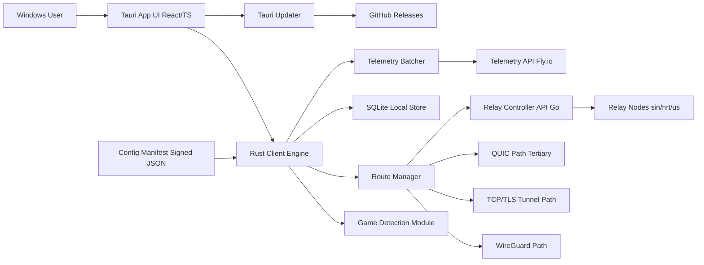

# Tech Stack & Architecture Decision - Kurangi Ping
> Version 1.0 · Status: Draft Approved · Last Updated: 2026-05-03

---

## 1) Overview

| Field | Value |
|---|---|
| Project | Kurangi Ping |
| Type | Windows desktop game routing optimizer |
| Primary Constraint | Budget Rp0, solo developer maintainability |
| Security Driver | Privacy-first, zero-log traffic policy |
| Launch Targets | Internal Beta: August 2026 · Public Launch: October 2026 |

Technology choices prioritize low runtime footprint, safe network-level implementation, and operational simplicity for a solo OSS project.

---

## 2) Architecture Style

**Chosen pattern:** Modular monolith (desktop-first) + lightweight distributed relay layer.

**Why this fits:**
- Solo developer can ship and maintain quickly.
- Clear module boundaries still allow gradual extraction later.
- Keeps complexity lower than microservices while supporting multi-region relays.

---

## 3) Technology Decisions

| Layer | Choice | Alternatives Considered | Why This Choice |
|---|---|---|---|
| Frontend Desktop UI | Tauri + React + TypeScript + Tailwind CSS + Zustand | Electron + React, WPF/.NET | Tauri binary footprint is much smaller and integrates natively with Rust backend. |
| Client Network Engine | Rust | Go, C++ | Memory safety + performance for always-on low-level networking code. |
| Routing Strategy | WireGuard-first -> TCP/TLS fallback -> QUIC tertiary | QUIC-first, TCP-only | More resilient against regional UDP throttling while still allowing high-performance path where available. |
| WireGuard Config Distribution | Signed JSON manifest verified with embedded client public key | Static hardcoded peer list, unsigned remote config | Enables account-less secure config updates with tamper verification. |
| Local Data & Settings | SQLite + JSON/TOML config | LiteDB, flat files only | Simple, robust local persistence for ring-buffer metrics and settings. |
| Relay Controller | Go | Rust for relay controller | Faster iteration for lightweight health API and relay management while Rust remains client focus. |
| Hosting & Infra | Fly.io (sin, nrt, then us region) + Cloudflare DNS/edge support | AWS/GCP full stack, single-region VPS | Free/low-cost start, practical multi-region deployment path. |
| Telemetry Transport | Self-hosted Fly.io endpoint, batch JSON events, schema allowlist, proxy strips X-Forwarded-For, no raw IP persistence | Third-party analytics SaaS, log collectors | Keeps privacy boundary under project control and enforces no-PII design. |
| Update Mechanism | tauri-plugin-updater via GitHub Releases | Manual download updates only | Critical for non-technical users to stay current and secure. |
| Windows Trust & Distribution | Code-signing required before public launch | Unsiged binaries with warning bypass | Avoids SmartScreen trust loss and reduces user-install friction. |
| Game Detection | Windows process listing via CreateToolhelp32Snapshot with executable allowlist | Process injection, packet inspection-first | Anti-cheat safer approach without invasive process manipulation. |
| CI/CD | GitHub Actions for build, test, packaging, release, updater artifacts | Local manual release process | Repeatable OSS workflow with lower release risk. |

---

## 4) Architecture Diagram

---

## 5) Key Architecture Decisions (Mini ADRs)

### ADR-01: Use Tauri over Electron
- **Decision:** Desktop shell is Tauri.
- **Context:** Target users often have entry-level gaming hardware and need low overhead.
- **Consequences:** Better footprint/perf, but requires Rust integration discipline.

### ADR-02: Keep client engine in Rust
- **Decision:** Routing/network core is implemented in Rust.
- **Context:** Long-running network process needs performance and memory safety.
- **Consequences:** Strong runtime safety; steeper learning/debug complexity than JS-only stack.

### ADR-03: Routing fallback order prioritizes TCP/TLS over QUIC
- **Decision:** WireGuard-first -> TCP/TLS fallback -> QUIC tertiary.
- **Context:** Some regional ISPs can degrade UDP-heavy protocols.
- **Consequences:** More reliable connectivity in constrained networks, possible latency trade-off when falling back.

### ADR-04: Anonymous telemetry is self-hosted with strict schema controls
- **Decision:** Batch events to Fly-hosted endpoint with no raw IP retention and schema allowlist.
- **Context:** Product promise is privacy-first and zero sensitive network logging.
- **Consequences:** Extra ops responsibility, but stronger trust and compliance with project values.

### ADR-05: Windows code-signing is mandatory before public launch
- **Decision:** Public binaries must be signed.
- **Context:** Unsigned binaries trigger severe SmartScreen warnings for mainstream users.
- **Consequences:** Adds release step and certificate/signing setup overhead, greatly improves install trust.

---

## 6) Development Environment

### Required Tools

| Tool | Version (Recommended) | Purpose |
|---|---|---|
| Node.js | 22 LTS | Frontend and build tooling |
| Rust | stable (latest) | Client engine + Tauri backend |
| pnpm | latest | JS package manager |
| Go | 1.23+ | Relay controller service |
| SQLite | 3.x | Local storage engine |
| Git | latest | Source control + CI integration |

### Local Setup Notes

1. Install Node.js, Rust, Go, and Tauri prerequisites for Windows.
2. Run frontend and Tauri app in dev mode.
3. Run local relay controller mock service for integration testing.
4. Use staging signed manifest keys for local verification tests.

### Environment Variables (Initial)

| Variable | Description |
|---|---|
| KP_ENV | Environment (`dev`, `staging`, `prod`) |
| KP_MANIFEST_URL | HTTPS endpoint for signed relay manifest |
| KP_MANIFEST_PUBKEY | Public key used for manifest signature verification |
| KP_TELEMETRY_ENDPOINT | Telemetry batch API endpoint |
| KP_UPDATE_CHANNEL | Updater channel (`beta`, `stable`) |
| KP_RELAY_HEALTH_URL | Relay health API base URL |

---

## 7) Constraints & Guardrails

- No process injection into game clients.
- No packet payload storage.
- No user account required in v1.
- Free/low-cost infra bias must remain unless explicitly re-approved.
- Any change to privacy boundary requires explicit PRD/FSD update.
